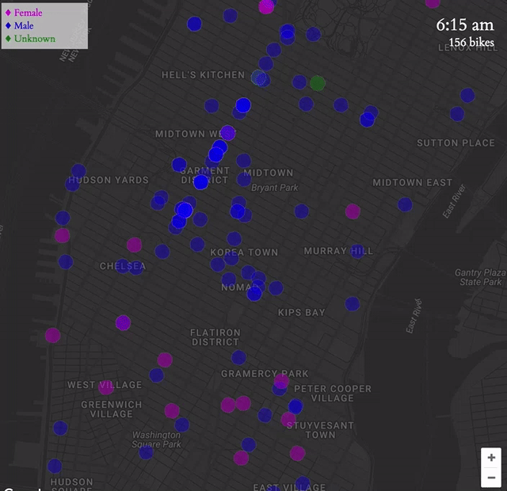

# A Day in the Life of Citi Bike
Who uses Citi Bike? Where do they go? [*A Day in the Life of Citi Bike*](http://mallorybulkley.com/citi-bike-visualization) is a visual exploration of these questions.

[Live](http://mallorybulkley.com/citi-bike-visualization)


## About
This visualization uses Citi Bike data along with Google Maps to show Citi Bike riders on December 1, 2016. Each circle on the map represents a single rider. I assume that each rider follows the route recommended by Google Maps bicycling directions. To avoid hitting the query limit on Google's Directions Services API, the data is all stored in a Firebase database. Additionally, by limiting the number of asynchronous requests that need to be made, points can be rendered very quickly on the map.



## Implementation
Everything is displayed on a single Google Maps `Map` object. Citi Bike's data provides the starting and ending latitude/longitude coordinates for each trip. I send these points to the Google Maps `Directions Services` API and retrieve the bicycling directions for each trip. The directions returned by Google Maps' API include a `Path` object with latitudes and longitudes for each inflection point along the route.

```javascript
let request = {
  origin: {
    "lat": parseFloat(trip['Start Station Latitude']),
    "lng": parseFloat(trip['Start Station Longitude'])
  },
  destination:  {
    "lat": parseFloat(trip['End Station Latitude']),
    "lng": parseFloat(trip['End Station Longitude'])
  },
  travelMode: 'BICYCLING'
}
```

Using the average speed and overall duration of the trip (calculated from the Citi Bike data) along with the distance between each point, I am able to calculate the estimated time between each inflection point along the route. The bikes are then drawn directly on the `Map` (as Google Map `Circle` objects) to approximate the actual speed of the riders along their route.

Every `Trip` depends on the current time. The app's clock sends out "ticks" to every trip object. Each `Trip` knows what time (in seconds/ticks) it begins, and after every step calculates how much time before it should move to its next step.

In the `CitiBikeViz` app:
```javascript
this.clockInterval = setInterval( () => {
  this.clock.add(1, "second")
  clock.innerHTML = this.clock.format("h:mm a");
  this.trips.forEach(trip => {
    trip.incrementTick();
  });
  count.innerHTML = window.tripCount + " bikes";
}, 10);
```

In each `Trip`:
```javascript
moveCircle () {
  if (this.currentStep === this.end) {
    this.endTrip();
  } else if (this.currentStep !== null) {
    // set the center and reset the tick and tickInterval
    this.currentStep += 1;
    this.circle.setCenter(this.path[this.currentStep]);
  } else {
    // start the trip
    this.beginTrip();
  }

  this.tick = 0;
  this.tickInterval = this.calculateInterval(this.currentStep);
}
```

The bikes can also be colored by age group or gender of the riders. This information is supplied by Citi Bike and stored in the Firebase database. When these color selections are turned on or off, the color of the `Circle` instances is set by these variables for each cyclist.
